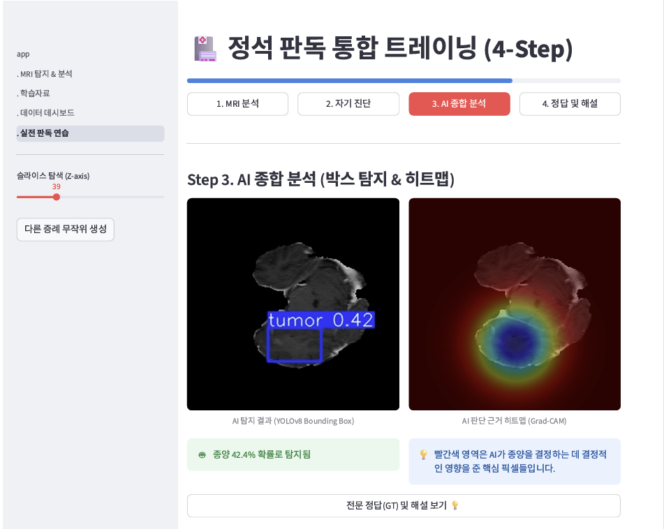
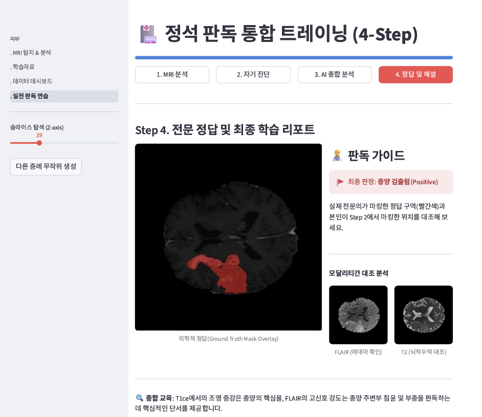

# Brain MRI 종양 탐지 및 의학 교육 플랫폼

본 프로젝트는 BraTS 2021 데이터셋과 YOLOv8 모델을 활용하여, 인공지능 기반의 뇌종양(Glioma) 탐지 및 진단과 의료진/학습자를 위한 전문적인 실전 판독 트레이닝 환경을 제공하는 웹 기반 플랫폼입니다.

---

## 🔗 서비스 바로가기
**[배포 링크: yolo-brats-export.streamlit.app](https://supabase.com/dashboard/project/fdrghtpwdegbizajelct/settings/general)**

---

## 📸 서비스 화면

### 1. AI 종합 분석 (Box Detection & Heatmap)
AI가 종양을 탐지한 영역과 판단의 근거가 되는 히트맵을 동시에 제공합니다.


### 2. 정석 실전 판독 트레이닝 (4-Step)
의료 교육 표준에 따른 판독 프로세스를 단계별로 가이드합니다.


---

## 핵심 기능

| 분류 | 기능명 | 상세 설명 |
| :--- | :--- | :--- |
| **의료 영상** | 3D NIfTI 볼륨 탐색 | .nii.gz 데이터를 로드하여 뇌의 모든 단면(Z-axis)을 슬라이더로 실시간 탐색 |
| **AI 탐지** | 실시간 종양 탐지 | YOLOv8 기반으로 뇌종양(Glioma) 위치를 바운딩 박스로 자동 식별 |
| **XAI** | Grad-CAM 히트맵 | AI가 종양을 판단할 때 주목한 픽셀 영역을 컬러맵으로 시각화하여 판단 근거 제시 |
| **교육** | 4단계 통합 트레이닝 | MRI 분석 > 자가 진단 > AI 대조 > 정답 및 해설로 이어지는 전문 판독 교육 프로세스 |
| **데이터** | 데이터 대시보드 | 환자별 모달리티(T1, T1ce, T2, FLAIR) 비교 및 데이터셋 통계 시각화 |

---

## 기술 스택

### 전처리 및 모델링
- **AI Model**: YOLOv8s (Ultralytics)
- **Deep Learning**: PyTorch, Torchvision
- **Training Env**: Google Colab (GPU T4)
- **Medical Imaging**: Nibabel, OpenCV (Headless)
- **Programming**: Python 3.10+

### 서비스 및 배포
- **Frontend/App**: Streamlit
- **Backend/DB**: Supabase (Detection History Management)
- **Infrastructure**: Streamlit Cloud

---

## 핵심 구현 기술

### 1. 3D NIfTI 의료 영상 제어 및 가시화
- Nibabel 라이브러리를 활용하여 3D 복셀(Voxel) 데이터를 로드하고, NumPy 연산을 통해 실시간 Z축 슬라이싱 구현.
- 브라우저 환경에서 대용량 NIfTI 파일을 효율적으로 처리하기 위해 `@st.cache_data`를 활용한 메모리 최적화 수행.

### 2. Grad-CAM 기반의 AI 판단 근거 시각화
- 모델의 최종 레이어 활성화를 역추적하여 종양 탐지 포인트의 중요도를 히트맵(Jet Colormap)으로 변환.
- YOLOv8 모델의 입력 크기 제약사항을 리사이징 로직으로 범용화하여 다양한 크기의 MRI 원본 데이터 지원.

---

## 트러블 슈팅 및 학습 전략

### 1. 학습 자원 제약 및 데이터 효율성 제고
- **문제**: BraTS 2021 영상 전처리 연산 비용이 과다하여 한정된 시간 내 전체 데이터 학습 불가.
- **해결**: 학습 데이터를 전체의 약 30%로 전략적으로 샘플링하여 전처리 시간을 단축하되, 에폭(Epoch) 수를 50~100회로 확보하여 모델의 특징 추출 밀도를 높임으로써 성능을 최적화함.

### 2. 검증 데이터셋(Validation Set) 불균형 조정
- **문제**: 무작위 샘플링 시 특정 크기나 위치의 종양만 검증 세트에 포함되어 모델의 객관적 성능 평가가 어려운 불균형 발생 확인.
- **해결**: 종양의 존재 여부 및 주요 위치 분포를 고려한 **층화 추출(Stratified Sampling)** 개념을 적용하여 검증 세트를 재구성했습니다. 이를 통해 모델이 편향된 데이터에 오버피팅되지 않도록 평가의 신뢰도를 확보했습니다.

### 3. 배포 환경(Linux) 및 텐서 규격 문제
- **문제**: OpenCV 로드 라이브러리 부재 및 MRI 원본(240x240)과 모델 규격(32배수) 사이의 충돌 발생.
- **해결**: `opencv-python-headless` 적용 및 256x256 리사이징 좌표 역보정 로직을 통해 호환성 해결.

---

## 로컬 실행 방법

1. **저장소 클론 및 패키지 설치**
```bash
git clone https://github.com/simplething4057/yolo_brasts_export.git
pip install -r requirements.txt
```

2. **애플리케이션 실행**
```bash
streamlit run app.py
```

---

## 향후 고도화 계획

### 1. 데이터셋 다각화를 통한 범용 모델 구축
- Glioma 외에 Meningioma, Pituitary Adenoma 등 **다양한 뇌종양 도메인 데이터를 추가 확보**하여 모델 가중치의 범용성을 극대화할 예정입니다.
- 공개된 대형 의료 데이터셋(예: Total Segmentator 등)을 보완 학습하여 예측 신뢰도를 향상시킬 계획입니다.

### 2. IoU 기반 평가 및 분석 리포트
- 학습자의 마킹 위치와 실제 마스크 사이의 IoU 점수를 실시간으로 수치화하여 객관적인 숙련도 리포트 제공.
- DICOM 표준 포맷 지원을 통한 병원 데이터 범용성 확보.
